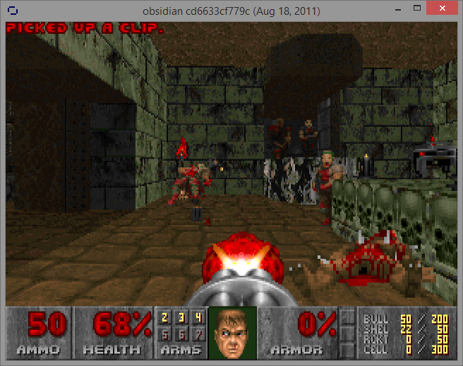

# Mirror of Obsidian

[Obsidian](https://www.chocolate-doom.org/wiki/index.php/Obsidian) is a source port and a fork of Chocolate Doom by tm512 that aims to be a "thin server" multiplayer port. It puts in new features that don't deviate too far from classic Doom, however, it is still in early development and it will likely stay like that for the saleable future as the last time the port was updated was in 2011.

You can join up to the port's IRC at #obsidian on irc.oftc.net if you have any questions, but seeing that the port has not been updated in a long time, it is questionable if anyone will be there; joining [the Chocolate Doom Discord server](https://discord.com/invite/fsVZfEE) might help you get a better reception for it.

## Versions in this repository

> **Obsidian 11.07a alpha (obsidian-win32-11.07a)**

As dated 2020-07-06, this is the earliest version available, the README has a few things of note, such as coop mode not working and that you should "always use -deathmatch or similar", "-altdeath and -newdeath likely do not work at all", and that "Exiting on MAP30 will probably mess up very badly".

> **Obsidian 11.07b alpha release (obsidian-win32-11.07b)**

As dated 2011-07-12. According to the README in this version "Coop mode doesn't work at all. Don't even try it, always use -deathmatch or similar", apparently there was going to be support for 16 players (rather than the normal four (4)), but it was still being worked on in this version. A kind of worrying thing noted in the README is that "Exiting on MAP30 will probably mess up very badly".

> **Obsidian 337 alpha release (obsidian-win32-r337)**

As dated 2011-08-18, this is the last known public version of the port that I know of, if there ever was another version, then it wasn't listed on the now deleted BitBucket page. Sadly, this version has no README file. I am guessing that this version never had one as all of the other versions here have one and it's not like I am going to delete a file for no reason at all.

## Versions that we are looking for
A few versions are not in this mirror, if you have a copy of one of the versions listed below, please do get in touch. So far, known lost versions are; 
* obsidian-src-11.07c
* obsidian-win32-11.07c

# Disclaimer Regarding This Project
Just because I have mirrored a project by another person, this **does not mean** in anyway, shape, or form that I agree or support the views of this project or even the person who made it, I have simply mirrored it for historical reasons as I have an interest in digital preservation. Over the years I have taken the time in archiving many items, many of witch can be seen [on my Internet Archive user page](https://archive.org/details/@14jammar). Following this, just because I have mirrored a project, this also does not mean that the author endorses me or my work.

If you are reading this and are wondering why exactly [that this disclaimer](https://github.com/DynTylluan/disclaimer) is inside of this project, it is simply here as a blanket way for getting out of trouble if myself or the project owner gets into hot water in some way, just in case. This is a standard text that is in all of [my GitHub](https://github.com/DynTylluan/) and (https://notabug.org/DynTylluan/)[NotABug] mirrors and does not automatically mean that the project owner is a bad person or to be untrusted.

You are welcome to delete this file, as it will not effect the main part of the project in anyway.

> Cass Python of [owlman.neocities.org](https://owlman.neocities.org)